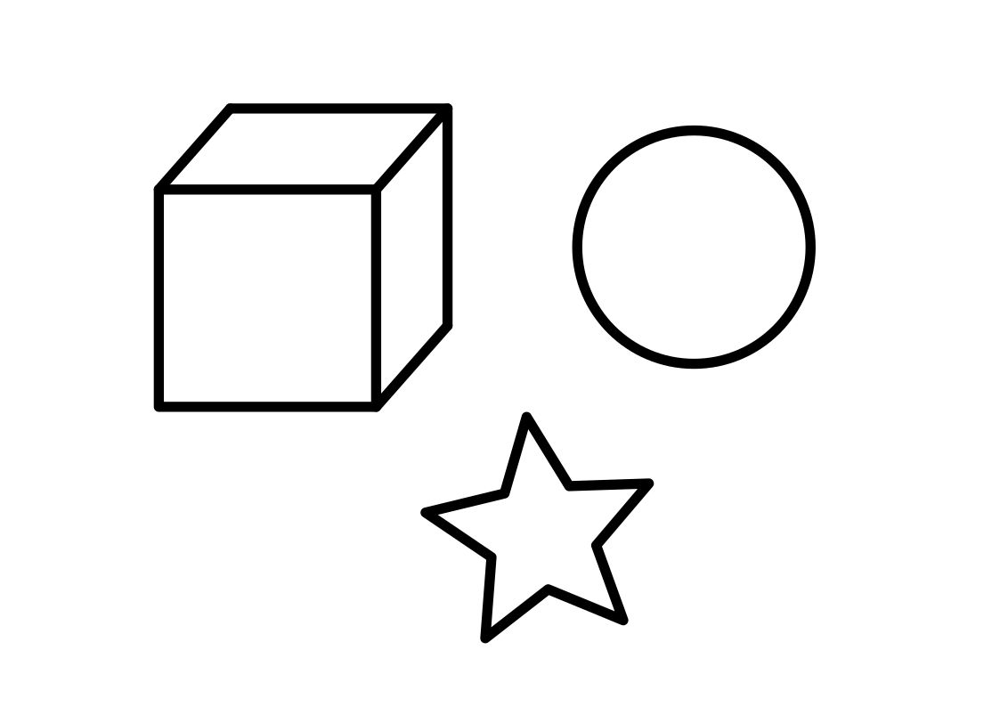
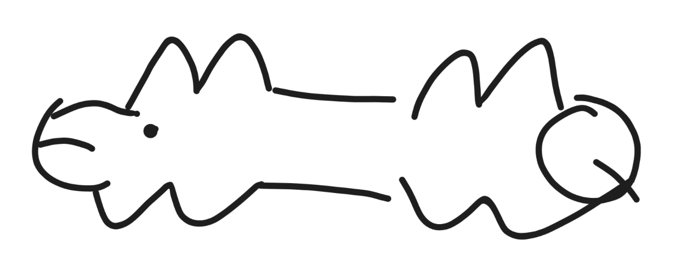

# Glyph-ASCII-Canvas

This program generates ASCII art from images using a sliding window template matching approach. Unlike simpler ASCII converters that map pixels directly to characters based on brightness, this algorithm considers the shape and spatial relationships by comparing image patches against rendered font templates using Mean Squared Error (MSE).

This method typically produces better results for line drawings and structural images by finding the character that structurally "fits" the underlying image patch best.

## Usage

```bash
python glyph-ascii-canvas.py [IMAGE_PATH] [OPTIONS]
````

NOTE: Currently, the image need to have a white background. I am to lazy to add an "invert" option in the script.

### Options

| Option | Long Option | Description | Default |
| :--- | :--- | :--- | :--- |
| `-w` | `--width` | Target output width (number of characters). Controls resolution. | `80` |
| `-r` | `--char-ratio` | Character height to width ratio. | `2.0` |
| `-s` | `--char-scale` | Font size scaling factor relative to the block size. | `1.0` |
| `-l` | `--linewidth` | Stroke linewidth used for generating character templates. | `0` |
| `-t` | `--threshold` | Binarization threshold (0-255). If unset, uses grayscale. | `None` |
| `-f` | `--font` | Path to a custom `.ttf` font file. | System default |
| `-c` | `--chars` | Custom ASCII character set to use for matching. | ASCII (32-126) |

## How It Works

The algorithm follows these steps to generate the ASCII output:

1.  Dynamic Template Generation:
      * Calculates the precise block size based on the input image width and desired output `--width`.
      * Loads the specified font and renders all candidate characters.
      * Determines a unified window size based on the maximum bounding box of the rendered characters to ensure alignment.

2.  Image Preprocessing & Padding:
      * Converts the input image to grayscale (or applies thresholding).
      * Pads the image borders intelligently to handle the sliding window at the edges without boundary errors.

3.  Sliding Window Matching:
      * Uses NumPy strides to create an efficient view of sliding windows over the image without duplicating memory.
      * Each window corresponds to a grid position in the output text.
      * Calculates the Mean Squared Error (MSE) between every image window and every character template.
      * Selects the character with the lowest error for each position.

## Requirements

  * Python 3.6+
  * Pillow (PIL Fork)
  * NumPy

## Example

The following examples use [Maple Mono](https://github.com/subframe7536/maple-font) font.


Export above .svg file to `./example/1.png` with size of `1200x823`. (Pillow don't support .svg input)

```
> python ./glyph-ascii-canvas.py -w 60 -s 2.5 -f ./MapleMonoNL-Regular.ttf ./example/1.png
       :                                                    
       |`3C"""""t;^r=~-            -~+=ct""````E`;          
       ]L )            `">~   -c"`            j  {          
        l  [               '^`                (  (          
        ]  [           ~:^""````":~          3   [          
         \ J-       <"             `">       L  J           
         ]  ]L    x'                  `5     t  /           
         -l ]L   /                      \    L  [`">        
      -c" ) x"` /                        \`"z~ {    `x      
   -<'     `   ]      *         /^~       L   `       `x    
  c`           #     /]L       J[ -\      \             `~  
  \           ]`    /  `>      {    )     ]             c`  
   `>         ] a  Jw*cff3o-   }cj"""}  * ]`^<       -c`    
     `x       -M \  #'   ]  `"z]b'   { x[o/   \    -c`      
       ^    >' {""\r[>~~<'      `:=c1<^ ]UL    `- <`        
        `>-<  /[   \                x[``]JL      `          
          `   [\    l^      ;'     -[   {-\                 
             {^]L   [ `"z+--  --+^' \  x[ `                 
                 ^-JL               {-<`                    
                   '                `                       

```

You can note the different in lines by the using of different args.

```
> python ./glyph-ascii-canvas.py -w 60 -l 4 -f ./MapleMonoNL-Regular.ttf ./example/1.png
                                                            
       /:yz~--,,,                        ,-x"""y>           
          )            `~       ,<"`          d  /          
        L  [               > <`               /  ]          
           }              ,-=zz=,                [          
         \ "         -"            `-        d              
            `      -                  `,                    
          L  \    (                     \       ("-         
        -`]  L<`,                        \>- ` <    l       
     -`    d                     -            "[      >     
   /           j     ,          [  L      )             h   
  ,            $    <``]       < ```)                    d  
   \                   ""\     ]``,,-}     `,          /    
     \           L  [<      b-  L<   /  (L,   -      /      
       L     ,`/,,) $    <      )   <  (       \   /        
        `   /  [   l                 [`"Y        y          
          `   (\    L        ,      (   / \                 
             <      [ `-          <`L   [`h                 
                 -         `````    <  /                    
                  `>L               \`                      
                                                            

```

Larger width give more detailed output.

```
> python ./glyph-ascii-canvas.py -w 120 -l 5 -s 1.5 -f ./MapleMonoNL-Regular.ttf ./example/1.png
                                                                                                                        
               .                                                                                                        
               b--~~--,.                                                            .,--~~~~~~~--,                      
               L   \.    ```````````'ao=~-,.                             .,--~s'````          /    L                    
               \    `                       ``'~,                 ,-<'```                   .j     b                    
               `     \.                          `'-.        .-<``                          `>    /                     
                L     \                              '-   ,<6                               ,(    /                     
                ]     L                                `=`                                  (     /                     
                 L    )                               ..,-----,.                           ,`     /                     
                 ]   .(                        ,-~a```          ``>-.                      \,     \                     
                  L  `>,                   ,<6`                      `'-.                 ,4     .b                     
                  `    ]                .<`                              `>,              (      /                      
                   L    ``-            <`                                   `-           <       (                      
                   ]     /           <`                                       `-          \     .b                      
                    L    `h        ./                                           L        <`     /`>-,                   
                   .)    <`       <`                                             \       `L    ,`    `>                 
                .-6` L   `> ,-s' <`                                               \>-.    `    (       `>               
              -d`    \   -}`    /                                                  L  ``a-.   /          `-             
           -a`       \,'`      <                                 ..                \       `>,(            `-           
        ,<`                    /            ,>                  .(`'-               >                        `>         
      ~`                      ^(           < ]                  /    `-             ]                          `>       
    -`                        [\          /  `,                <       h.            L                           `> .   
   /                         <[b         /`==a\.               ( ~ua'`` `            \                            -6    
    `,                       /          /      `>             /          `.          ]                          -`      
     `L                      (         .b     >~~}@,          / aaao     .]          ]`-                      -`        
       `>.                   }  <-     /,----~a''`'[`-.        L<'"(`````  L     >   /  `>,                 -`          
         `>                  ] <8`>    /( .]       /   `>,     )L  /       L    /`,  /     L,             -`            
           `-                .L/  `>    [(         /      ``a~,/(``       /    <` ]><       `>          ~`              
             `-            ,6 ][    \,  [L         (            \       .<`  ./  ,  (         \       -`                
               h.        ,/   |(`````['~/8\-.  .,<`              `>---<'`(,-'`   / /           `>   ,/                  
                `>      <`   .[       >                                   ]`o=~=>( /             `><`                   
                  \.  ,/     /(        L                                 /       ( `.                                   
                   `y;`     / \         L                               /        L  \                                   
                           <8 `.        ]  >            ```             \       <.   >                                  
                          .(   \        /   `>.                     .<6 L       / `'~/,                                 
                          /-a   L      .b      `'~,.            .-<`     >     <                                        
                                 L.    /            ```'avaa'```         \    <`                                        
                                  `>   /                                <   ,4                                          
                                    `>- L                               (-s`                                            
                                       ``                                                                               
                                                                                                                        
                                                                                                                        

```

### Other examples:

Original image : 



```
> python ./glyph-ascii-canvas.py -w 60 -s 2.5 -f ./MapleMonoNL-Regular.ttf ./example/2.png
                                                               
                                                               
                                                               
             <````````````QMC            -~~~-                 
           *(           -Z[]C         <C`    ``b~              
         v#mmmmmmmmmmmm<{  ]C       yC          ]5             
         ]C            [   ]C       (             l            
         ]C            [   ]C      JL             )            
         ]C            [   ]C       \             [            
         ]C            [   ]C       ]>          -/             
         ]C            [  <{          `zw-   -<^`              
         ]C            [*C               ````                  
         ]ttttttttttttt"        >                              
                                {3~                            
                               7  }w~~~~~                      
                          *m^""`      ]/                       
                           `^>       4(                        
                              )      \                         
                              ( *C`tmw\                        
                              P"      `                        
                                                               
                                                               
                                                               

```


```
> python ./glyph-ascii-canvas.py -f ./MapleMonoNL-Regular.ttf ./example/3.png -w 50 -s 2 -l 2
                                                      
                  -~wmmq999mm=--                      
              ~f"``            ``"b~                  
            d{                      `3>               
           /                           `b-            
         <[                              `h           
         {                                 \-         
        /                                   }L        
        [         dF           <e            }        
       ]         `             ``             \       
       ]                                      }       
     - ]L                                     ]       
     \                                        [       
     ]L                                      /        
      ]L                                    /`        
       `h             ""````               /          
         }>                              d[           
           \>                         -f`             
             `3>-                  <f`                
                ``"pw~~-----~=mf"``                   
                           ][                         
                           {                          
                          d[       ~m"``              
                          { -~mf"``                   
                 <mmqff"`$[`  \                       
                         {     }>                     
                         [       \>                   
                                   `'                 
                                                      
                                                      
                                                      
                                                      

```



```
> python ./glyph-ascii-canvas.py -f ./MapleMonoNL-Regular.ttf ./example/4.png -s 1 -l 2
                                                                                    
                                                                                    
                    am     ,#"o                                  <~                 
                   $  ],  4    $                      ,#"&    -$   L                
                 ,(    ] $      &                    $    L  $     $                
                -(      [       ]<~-               <(     L4`      ]                
      <`-qP"9m,<`                          `````  ,`      $         L,--`"m         
     $`           ,                               `               ,F`       &       
    j,-~~,        `                                              <           $      
    $                                                            ]           ]      
    `>                                                            @      `@  $      
       "9qmmF`     ,P         -PPPPP%gqm=--,     $                 ]~     ,]$       
            L    -$  $      <[                 `  $      ,P$          `$$``  `      
            ]-,<{     $>-<P                        $, ,<{   ]       ~P`             
                                                             `Q%P"`                 
                                                                                    

```


```
> python ./glyph-ascii-canvas.py -f ./MapleMonoNL-Regular.ttf ./example/5.png -s 1.5 -l 2
                                                  <"""n                          
                                   -=^"``        `      L                        
               -ar=-  a"`     `  `                      L                        
             4`     `                                 -`                         
             \                                         `-                        
              `                                          l                       
                                                          \                      
              ]          m                 ``             ]                      
              {                                           ]  -r"````y            
              ]                  ` L                       `          L          
               \                   [-                                 {          
         -^``   `             <- -<`]~-=`                            <           
        (                         [   }                             /            
       [                          l  -[                           ^`             
       L                           ``                            ]               
       \                                                         {               
        l                                                        ]    a`` [      
         `>                                                       ]w`  -C        
           `L                                                      `w"`          
            ]                                                        `-          
             L                       -~a^"``````"r=~-                  L         
             L                 ~r"`                    `"^~            [         
            ]           /""``                               ``"^^'  -f`          
            {          /                                         ``              
            \        <`                                                          
             `"^wr"`                                                             
                                                                                 

```

